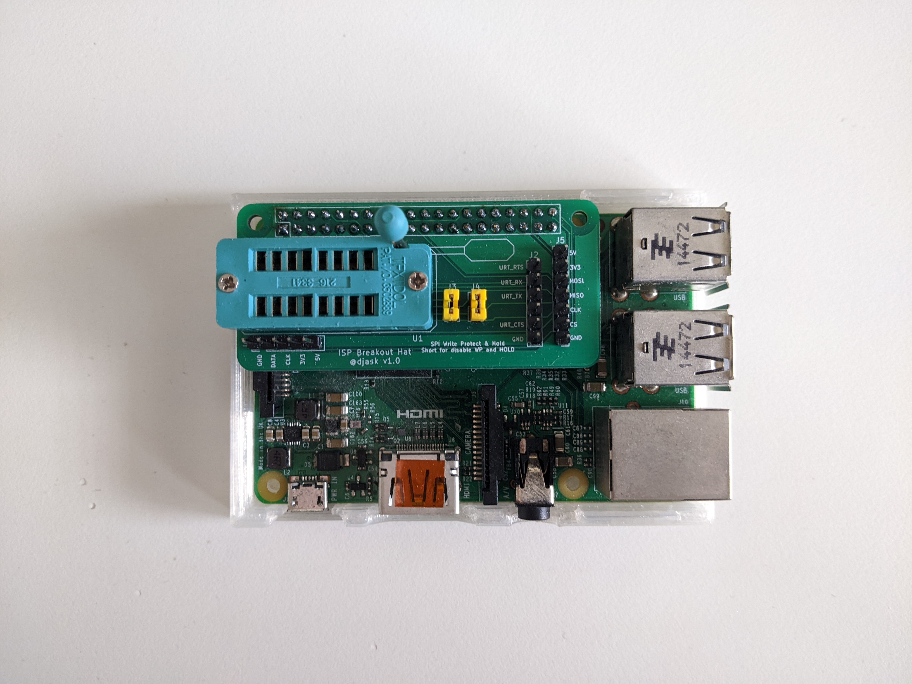

# rpi_spi-breakout
 

 A simple Raspberry Pi breakout hat to make in circuit programming and chip programming easier. Takes a standard SOP16 ZIF socket so should be compatible with all the aliexpress chip adapters as well.

 Has UART, I2C, SPI breakouts for most common chips.

 Also has a header for a TTL-232R-3V3 UART adapter (5v not connected)

 ## BOM
 - 1x PCB
 - 22x Standard Header Pins Pins
 - 2x Jumpers for Write Protect and Hold
 - 1x ZIF socket